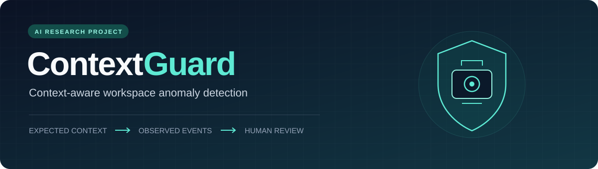
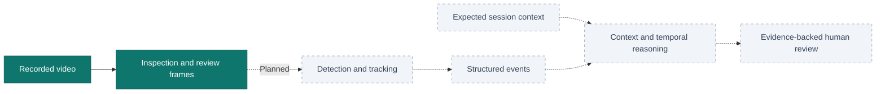

<div align="center">



**Understanding what happened starts with knowing what was expected.**

[](https://github.com/washam1337/ContextGuard/actions/workflows/tests.yml)


[Quick start](#quick-start) · [Current capabilities](#current-capabilities) · [Roadmap](#roadmap) · [Documentation](#documentation)

</div>

## Overview

ContextGuard is an AI final-year project at **FAST NUCES** exploring context-aware
anomaly detection in a controlled office. Its central research question is whether
comparing **expected activity with observed events over time** can produce more
useful, explainable alerts than isolated detections alone.

The initial scope is one fixed camera, one office, and two registered assets: a
laptop and a backpack. Planned scenarios cover excess simultaneous visitor
occupancy and observed asset departure inconsistent with session permissions.
Potential anomalies require human review; the system must not infer criminal intent.

> **Current milestone: recorded-video inspection (CG-002).** The runnable tool
> inspects local recordings and exports a JSON report and representative frames.
> Detection, tracking, context reasoning, and anomaly decisions are planned.
> Validation currently uses synthetic software fixtures; no research results or
> real-office performance claims are available.

## Current capabilities

| Capability | Status |
| --- | --- |
| Headless inspection of local recorded video | Implemented |
| Sequential decoded-frame counts and observed dimensions | Implemented |
| Reported metadata, timing limitations, and decode warnings | Implemented |
| First, middle, and last decoded-frame JPEG exports | Implemented |
| Versioned JSON inspection report | Implemented |
| Person/asset detection, tracking, zones, and structured events | Planned |
| Expected-versus-observed reasoning and evidence-backed review | Planned |
| Dashboard, feedback, and comparative evaluation | Planned |
| Audio and accessibility workflows | Deferred from the current build |

The inspector runs on CPU, opens no GUI windows, and processes frames sequentially
without holding the entire recording in memory. It refuses existing output paths.

## Quick start

Use **Python 3.10** (the verified development version). Run these commands in a
terminal on Linux or macOS:

```bash
git clone https://github.com/washam1337/ContextGuard.git
cd ContextGuard
python3 -m venv .venv
source .venv/bin/activate
python -m pip install -r requirements.txt
```

On Windows, create the environment with `py -3.10 -m venv .venv` and activate it
with `.venv\Scripts\Activate.ps1` in PowerShell. The automated test suite currently
targets Linux.

Inspect a finished, stable recording, choosing an output directory that does not
already exist:

```bash
python scripts/inspect_video.py \
  --input /path/to/recording.mp4 \
  --output outputs/pilot-review-001
```

For CLI help:

```bash
python scripts/inspect_video.py --help
```

The project currently needs only OpenCV and its transitive dependencies. No model
weights, GPU, camera connection, or external service are required. Video codec
support depends on the local OpenCV build.

### Output

For a recording with 12 successfully decoded frames, the output layout is:

```text
outputs/pilot-review-001/
├── inspection.json
├── frame_00000000.jpg
├── frame_00000005.jpg
└── frame_00000011.jpg
```

Short recordings may yield fewer than three distinct samples. The report uses
schema `contextguard.video_inspection.v1` and keeps container metadata separate
from decoded observations. See the [inspection guide](docs/VIDEO_INSPECTION.md)
for report fields, exit codes, and interpretation.

Review the JPEGs for doorway coverage, asset visibility, lighting, occlusion, and
object size. Also watch the source recording: three samples cannot establish
quality throughout a video. These exports are placement-review artifacts.

## How the project fits together



Solid nodes show the current inspection workflow. Dashed nodes show the planned
research pipeline. Observation, inference, explanations, and human feedback remain
separate design concerns. Missing detections or lost tracks alone must not be
treated as proof that an asset departed.

## Roadmap

- [x] Record the refined project scope and working decisions.
- [x] Build and test a recorded-video inspection utility.
- [ ] Collect a consented staged pilot and review camera placement.
- [ ] Establish a CPU-compatible pretrained detection/tracking baseline.
- [ ] Add zones, asset state, structured events, and session permissions.
- [ ] Compare observed activity against expected context using deterministic rules.
- [ ] Produce traceable evidence windows and human-review explanations.
- [ ] Evaluate baselines, false positives, and the contribution of context.

The [CG-002 scope amendment](MASTER_PLAN.md#scope-amendment-cg-002--2026-09-27)
governs the current build. The broader original specification is retained for
traceability; learned temporal modelling remains optional/proposed.

## Development

With the environment activated, run the existing suite:

```bash
python -B -m unittest discover -s tests -v
```

The 10 tests cover a synthetic MJPEG encode/decode round trip, source preservation,
output collision and symlink handling, invalid inputs, invalid metadata, and
reported-versus-decoded mismatches. Fixtures are generated in temporary storage
and are **software test data, not a research dataset**. GitHub Actions runs the
same suite on Python 3.10.

```text
ContextGuard/
├── scripts/inspect_video.py    # Runnable inspection CLI
├── tests/test_inspect_video.py # Unit and integration checks
├── docs/                      # Usage, decisions, progress, and handoff
├── .github/                   # CI and contribution templates
├── MASTER_PLAN.md             # Project specification and scope amendment
├── CONTRIBUTING.md            # Development and contribution guidance
└── requirements.txt           # Current runtime dependency
```

## Documentation

| Document | Purpose |
| --- | --- |
| [Video inspection guide](docs/VIDEO_INSPECTION.md) | Report format, limitations, and troubleshooting |
| [Master plan](MASTER_PLAN.md) | Research direction and authoritative scope |
| [Working decisions](docs/DECISIONS.md) | Accepted scope refinements and pending decisions |
| [Progress](docs/PROGRESS.md) | Implementation status by component |
| [CG-002 handoff](docs/HANDOFF.md) | Historical verification record and next milestone |
| [Contributing](CONTRIBUTING.md) | Local checks and contribution expectations |

## Research data and licensing

Recordings, generated inspection reports, model weights, and local credentials are
excluded by repository ignore rules. Reports contain the absolute source path;
review reports and images before sharing them. Any future office dataset requires
consent and controlled collection.

No open-source license has been selected yet. Public availability alone does not
grant a license to reuse or redistribute the code.
